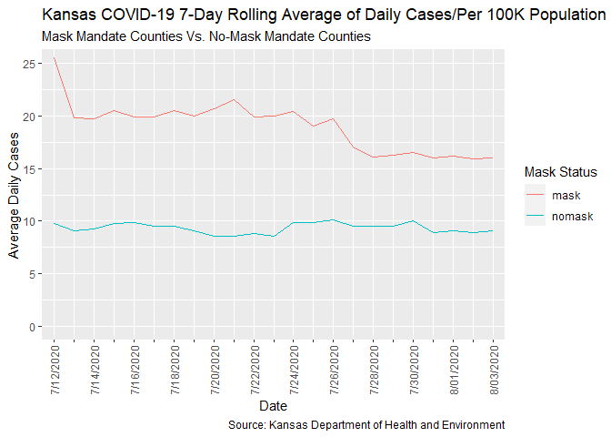

Lab 07 - Conveying the right message through visualisation
================
Cat Seitz
02/13/2023

### Load packages and data

``` r
library(tidyverse) 
library(dsbox)
library(mosaicData) 
library(ggbreak) 
library(patchwork)
```

### Exercise 1

The original visualization is quite misleading. At first glance, they
are trying to make it seem like wearing masks decreases the number of
COVID cases. However, there are several problems with their plot. 1)
There are 2 y-axes that aren’t labeled, so we can’t really tell which
one is the average daily cases. They make it seem like the mask counties
correspond to the left axis and the no-mask counties correspond to the
right axis, but it’s not super clear and that seems weird because the
y-axes aren’t that different. 2) Also, the x-axis is only 15-ish days
worth of data, so the graph creator could’ve chosen a time frame that
displayed that wearing masks is better for not contracting COVID.

``` r
mask<- tribble(
  ~date, ~count, ~mask_status,
  "7/12/2020", 25.5, "mask",
  "7/13/2020", 19.8, "mask",
  "7/14/2020", 19.7, "mask",
  "7/15/2020", 20.5, "mask",
  "7/16/2020", 19.9, "mask",
  "7/17/2020", 19.9, "mask",
  "7/18/2020", 20.5, "mask",
  "7/19/2020", 20.0, "mask",
  "7/20/2020", 20.7, "mask",
  "7/21/2020", 21.5, "mask",
  "7/22/2020", 19.9, "mask",
  "7/23/2020", 20.0, "mask",
  "7/24/2020", 20.4, "mask",
  "7/25/2020", 19.0, "mask",
  "7/26/2020", 19.7, "mask",
  "7/27/2020", 17.0, "mask",
  "7/28/2020", 16.1, "mask",
  "7/29/2020", 16.3, "mask",
  "7/30/2020", 16.5, "mask",
  "7/31/2020", 16.0, "mask",
  "8/01/2020", 16.2, "mask",
  "8/02/2020", 15.9, "mask",
  "8/03/2020", 16.0, "mask",
  "7/12/2020", 9.8, "nomask",
  "7/13/2020", 9.1, "nomask",
  "7/14/2020", 9.3, "nomask",
  "7/15/2020", 9.8, "nomask",
  "7/16/2020", 9.9, "nomask",
  "7/17/2020", 9.5, "nomask",
  "7/18/2020", 9.5, "nomask",
  "7/19/2020", 9.1, "nomask",
  "7/20/2020", 8.6, "nomask",
  "7/21/2020", 8.6, "nomask",
  "7/22/2020", 8.8, "nomask",
  "7/23/2020", 8.6, "nomask",
  "7/24/2020", 9.9, "nomask",
  "7/25/2020", 9.9, "nomask",
  "7/26/2020", 10.1, "nomask",
  "7/27/2020", 9.5, "nomask",
  "7/28/2020", 9.5, "nomask",
  "7/29/2020", 9.5, "nomask",
  "7/30/2020", 10.0, "nomask",
  "7/31/2020", 8.9, "nomask",
  "8/01/2020", 9.1, "nomask",
  "8/02/2020", 8.9, "nomask",
  "8/03/2020", 9.1, "nomask",
)
```

### Exercise 2

``` r
xlabels <- sort(unique(mask$date))
xlabels[seq(2, length(xlabels), 2)] <- ""

mask %>%
  ggplot(aes(x = date,
             y = count,
             group = mask_status,
             color = mask_status)) +
  geom_line()+
  theme(axis.text.x = element_text(angle = 90, vjust = 0.5, hjust=1))+
  coord_cartesian(ylim = c(0,25))+
  labs(title = "Kansas COVID-19 7-Day Rolling Average of Daily Cases/Per 100K Population",
       subtitle = "Mask Mandate Counties Vs. No-Mask Mandate Counties",
       x="Date",
       y="Average Daily Cases",
       caption = "Source: Kansas Department of Health and Environment")+
  guides(color=guide_legend(title = "Mask Status"))+
  scale_x_discrete(labels=xlabels)
```

<!-- -->

### Exercise 3

In my visualization, the distinction between mask mandate counties and
no-mask mandate counties is much more clear, especially with regards to
the average daily cases in each place. Now, we can clearly see that
no-mask mandate counties have much fewer cases than mask mandate
counties, which is opposite to what the original visualization was
trying to show. In addition, I made the x-axis display every-other date
to make it less cluttered.

### Exercise 4

This data, which is only 22 days worth of data, shows that counties
where there is not a mask mandate have around 10 COVID cases daily and
counties with a mask mandate have around 20 COVID cases daily. While
this may seem like masks are worse for contracting COVID, there could be
a different reason the data look like this. For example, it’s likely
that counties that enforced a mask mandate were ones that had higher
daily cases than counties that didn’t enforce a mask mandate.
